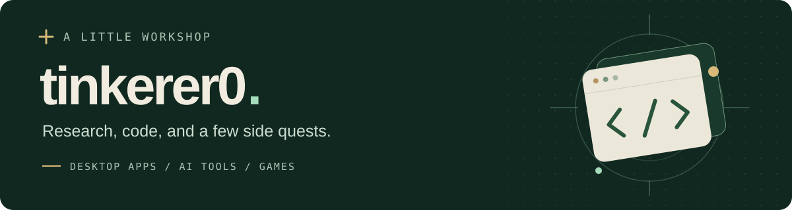
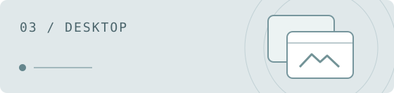

 

I build small desktop apps, tools for AI-assisted development, and games.
This is a collection of things I've made and experiments I'm working on.

[한국어](README.ko.md) &nbsp;·&nbsp; [All projects](docs/PROJECTS.md) &nbsp;·&nbsp; [Games & experiments](docs/GAMES.md)

## Selected projects

<table>
<tr>
<td width="50%" valign="top">

### [MemoBuddy](https://github.com/tinkerer0/MemoBuddy)

A tiny desktop pet that keeps your text and drawing notes.

Windows app · Mac App Store version planned

[Get the app](https://apps.microsoft.com/detail/9mv1clqjv6cx) · [Support](https://github.com/tinkerer0/MemoBuddy/issues)

</td>
<td width="50%" valign="top">

### [done-contract](https://github.com/tinkerer0/done-contract)

Runs agreed checks before an AI coding agent reports a task complete.

Python · CLI hooks · Open source

[How it works](https://github.com/tinkerer0/done-contract#readme) · [Source](https://github.com/tinkerer0/done-contract)

</td>
</tr>
<tr>
<td width="50%" valign="top">

### [DeskWidget](https://github.com/tinkerer0/DeskWidget)

Turn your own images into movable, resizable desktop widgets.

Windows · Electron · Source &amp; packaging guide

[Source & setup](https://github.com/tinkerer0/DeskWidget#readme)

</td>
<td width="50%" valign="top">

### [mote](https://github.com/tinkerer0/mote_game)

A small browser arcade game about absorbing light and growing.

JavaScript · Canvas 2D · Playable prototype

[Play in your browser](https://tinkerer0.github.io/mote_game/) · [Source](https://github.com/tinkerer0/mote_game)

</td>
</tr>
</table>

## In the toolbox

Technologies used across my public projects.

## More to explore

- **Desktop tools** — [DeskPin](https://github.com/tinkerer0/desk_pin) · [AI Usage Widget](https://github.com/tinkerer0/ai_usage_widget_kit)
- **AI workflows** — [evidence-gate](https://github.com/tinkerer0/evidence-gate) · [Orca coordination](https://github.com/tinkerer0/orca-autonomous-coordinator) · [More tools](docs/PROJECTS.md#개발-도구와-작업-지침)
- **Side quests** — [Browser games & terminal experiments](docs/GAMES.md)

---

Project status and setup live in each repository. Feedback is welcome through issues or pull requests. 
<a href="LICENSE">MIT</a> for this profile's documents; linked projects have their own licenses. <a href="assets/README.md">Asset credits</a>.
